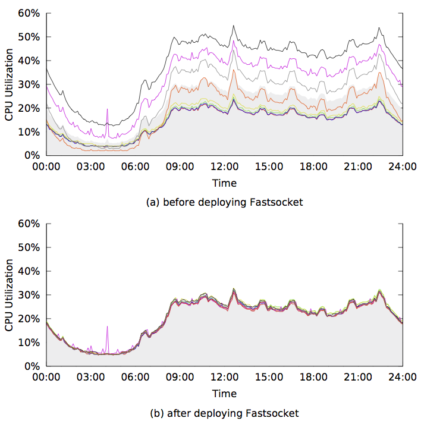

 README for FASTSOCKET
========================================================================

## TABLE OF CONTENT ##
* [Introduction](#introduction)
* [Participants](#participants)
* [Installation](#installation)
  * [Install From Source](#install-from-source)
  * [Switch Kernel](#switch-kernel)
* [System Configuration](#system-configuration)
* [Usage](#usage)
  * [Suitable Scenarios](#suitable-scenarios)
  * [How To Use] (#how-to-use)
  * [Demo Server](#demo-server)
* [Evaluation](#evaluation)
  * [Nginx] (#nginx)
  * [HAProxy] (#haproxy)
  * [Online Evaluation](#online-evaluation)
* [New Features](#new-features)
* [Contacts](#contacts)

## INTRODUCTION ##

With a rapid growth of NIC bandwidth and CPU cores on one single machine, a 
scalable TCP network stack is performance-critical. However, stock Linux 
kernel does not scale well when CPU core number is above 4. It is even worse 
that the throughput could collapse when there are more than 12 CPU cores.

Fastsocket is a scalable kernel TCP socket implementation and achieves a straight 
linear performance growth when scaling up to 24 CPU cores. 
Meanwhile, The underlying kernel optimization of Fastsocket is transparent for 
socket applications, which means existing applications can take advantage of 
Fastsocket without changing their codes.

Currently Fastsocket is implemented in the Linux kernel(kernel-2.6.32-431.17.1.el6) 
of CentOS-6.5 which is the latest version of redhat EL6, 
since CentOS-6.5 is our major production environment system. 
According to our evaluations, Fastsocket increases throughput of Nginx and
HAProxy(measured by connections per second) by **290%** and **620%** on a 
24-core machine, compared to the base CentOS-6.5 kernel.

Moreover, Fastsocket can further exploit more from the hardware:

- With Fastsocket, Hyper-Threading can make an extra **20%** performance increase.
- With Fastsocket, NIC that support Flow-Director(like Intel 82599) can increase 
the throughput by **15%** if the server works as a proxy(like HAProxy).

Fastsocket (V1.0) has already been deployed in the SINA production environment. 
Fastsocket is used with HAProxy to provide HTTP load balance service and 
has been running stably since March 2014 More details are in
the [Evaluation](#online-evaluation).

Fastsocket is released under GPLv2 and we promise that we would never ask for any
 payment to use our codes.

## PARTICIPANTS ##

- Fastsocket is started and mainly developed by Xiaofeng Lin from the OS team of SINA.COM.
- OS center of Tsinghua is cooperating closely with SINA.COM to further enhance Fastsocket.
- Fastsocket is also supported by Intel with extensive assistance.
- Zeuux Community is providing open source consulting for Fastsocket.

## INSTALLATION ##

### INSTALL FROM SOURCE ###

The source code is available at https://github.com/fastos/fastsocket.git. Clone the repository by:

	[root@localhost ~]# git clone https://github.com/fastos/fastsocket.git

Here is a brief introduction to the directories in the repository.

* **kernel** - source code of the Fastsocket customized kernel
* **module** - source code of the Fastsocket kernel module
* **library** - source code of user-level library to support Fastsocket
* **scripts** - scripts to set NIC and system environment(NOT compulsory for Fastsocket)
* **demo** - source code of a demo server to demonstrate performance of Fastsocket

The following commands will build and install the kernel after Fastsocket repository
is downloaded from git. You can customize the config file if you are sure you will 
not miss some important component.

	[root@localhost ~]# cd fastsocket/kernel
	[root@localhost kernel]# make defconfig
	[root@localhost kernel]# make
	[root@localhost kernel]# make modules_install
	[root@localhost kernel]# make install

Enter the library directory and make the library:

	[root@localhost fastsocket]# cd library
	[root@localhost library]# make

After that, libfsocket.so is created in the same directory.

### SWITCH KERNEL ###

When the installation is done, remember to modify grub file to switch to the 
Fastsocket kernel and reboot the system.

## SYSTEM CONFIGURATION ##

After booting into the kernel with Fastsocket, load the Fastsocket module with 
default parameters:

	[root@localhost ~]# modprobe fastsocket

For more detailed information of modules parameters, please refer to [Module](module/README.md "Fastsocket Module").

Two ways to check if the module is loaded successfully.

* Check lsmod:

		[root@localhost ~]# lsmod | grep fastsocket
		fastsocket             23145  0

* Check dmesg:

		[root@localhost ~]# dmesg | tail
		Fastsocket: Load Module
		Fastsocket: Enable Listen Spawn[Mode-2]
		Fastsocket: Enable Recieve Flow Deliver
		Fastsocket: Enable Fast Epoll

Run **nic.sh** provided in the scripts directory of the repository to take care of 
remaining configuration.

	[root@localhost ~]# cd fastsocket
	[root@localhost fastsocket]# scripts/nic.sh -i eth0

*eth0* is the interface to be used and should be changed according to your
system configuration. The script will automatically check system and NIC 
parameters, then configures various features.

If you are interested in how nic.sh works, please refer to [Scripts](scripts/README.md "Configuration Scripts").

## USAGE ##

### SUITABLE SCENARIOS###

Generally, scenarios meeting the following conditions will benefit the most 
from Fastsocket (V1.0):

* The machine has no less than 8 CPU cores.
* Large portion of the CPU cycles is spent in network softirq and socket 
related system calls.
* Short TCP connections are heavily used.
* Application uses non-blocking IO over epoll as the IO framework.
* Application uses multiple processes to accept connections individually.

Meanwhile, we are developing Fastsocket to improve the network stack performance 
in more general scenarios. You can refer to [New Features](#new-features).

### HOW TO USE ###

Fastsocket is enabled by preloading a shared library named libfsocket.so 
when launching an application. For example, ngnix can be started with Fastsocket by:

	[root@localhost fastsocket]# cd library
	[root@localhost library]# LD_PRELOAD=./libfsocket.so nginx

Without the preloaded library, applications can run as if they are on the
original kernel, which provides a super quick rollback in case there is a need. 

	[root@localhost ~]# nginx

For more information about the library, please refer to [Library](library/README.md "Fastsocket Library").

Here we list a few applications that are working fine with Fastsocket:

* haproxy
* nginx (Do disable accept mutex)
* lighttpd

We are also using Fastsocket on the load generators in our benchmark tests. 
This is very helpful since Fastsocket greatly increases the maximum work load that 
could be generated from a single machine, which saves machines and operations. 
These load generators are:

* ab
* http_load

### DEMO SERVER ###

We provide a demo server in the demo directory of the repository. The demo 
server does nothing but read/write messages from/to network sockets and is 
purely used to study and benchmark the performance of network stack of Linux 
kernel. When the demo server is running, it has little user CPU consumption, 
which makes it a perfect network application to observe the network stack 
performance.

Moreover, it is also used to demonstrate the scalability and performance 
improvement of Fastsocket over the base Linux kernel.

For more information about the demo server, please refer to [Demo](demo/README.md "Demo Server").

## EVALUATION ##

### Nginx ###

Some important configurations:

- Worker number is set to the number of CPU cores.
- HTTP Keep-alive is disabled on Nginx for a short connection test.
- Http_load fetches a 64 bytes static file from Nginx with a concurrency of 500
  multiplied by the number of cores.
- We enable memory cache for that static file in order to rule out any disk affection.
- **accept mutex is disabled**.

Note: **DO DISABLE accept_mutex!** With default Fastsocket module parameters, 
Fastsocket has partioned listen socket, therefore, there is no need to force
user to accept connections one by one.

From the figure below, Fastsocket on 24 CPU cores achieves 475K connection per second (cps), 
with a speed up of 21X. The throughput of base CentOS-6.5 kernel increases
non-linearly up to 12 CPU cores and drops dramatically to 159K cps with 24 CPU cores. The
latest 3.13 kernel doubles the throughput to 283K cps when using 24 CPU cores compared
with the base CentOS-6.5 kernel. However, it has not completely solved the scalability bottlenecks,
preventing it from scaling beyond 12 CPU cores.

### HAProxy ###

Some important configurations:

- Worker number is set to the number of CPU cores.
- RFD(Receive Flow Deliver) in Fastsocket is enabled.
- HTTP Keep-alive is disabled on HAProxy for a short connection test.
- A client runs http_load with a concurrency of 500 multiplied by number of cores.
- A backend server responds each incoming HTTP request with a 64 bytes message.

As shown in the same figure, Fastsocket presents an excellent scalability performance, 
which is very similar to the previous Nginx case. 
Fastsocket outperforms Linux 3.13 by 139K cps and base CentOS-6.5 kernel
by 370K cps when using 24 CPU cores, though the one core throughputs are very close among
all the three kernels.

### ONLINE EVALUATION ###

As mentioned before, Fastsocket has already been deployed in the SINA production
environment. One typical scenario is using Fastsocket with HAProxy to provide 
HTTP load balance service to WEIBO and other SINA productions.

In the figure below, it is the CPU utilization of a 8-core servers within 24 hours. 
Figure (a) shows the CPU utilization before deploying Fastsocket and figure (b)
shows the CPU utilization after deploying Fastsocket.

We can see from the figure, what happened after Fastsocket is used:

- The load of each CPU core is perfect balanced.
- The average CPU utilization of all CPU cores is reduced by 10%.
- As a result, the effective capacity of the HAProxy server is increased by 85%.

Moreover, since the server is an old 8-core machine, we expect Fastsocket would 
make more performance improvement when Fastsocket is deployed on a machine with 
more CPU cores (It is already observed on a 12-core machine after updating Fastsocket).

## NEW FEATURES ##

We are now improving network stack efficiency in the case of long TCP connection.
Four more features are introduced:

- **Direct-TCP**: Skip the route process when receiving packets if these packets belong
to upper TCP sockets.
- **Skb-Pool**: Get skb from per-core pre-allocated skb pool instead of kernel slab.
- **Receive-CPU-Select**: Steer a packet to a CPU core where application is waiting for it. 
The idea is similar with RFS from Google, however, it is lighter and more accurate.
- **RPS-Framework**: We extend the idea of RPS that is to redispatch the receiving packets 
before they entering the network stack. We build a framework where developers can 
implement their own packets-redispatching rules in out-of-tree module and hook into 
the RPS framework.

We evaluated our new work on redis which is a typical and popular key-value cache application.

Some important configurations:

- Redis works in persistent TCP connection mode.
- Multiple Redis instances are set up.
- Each Redis instance listens on a different port and binds to a different CPU core.

The 8-redis-instance test shows:

- With commodity NIC supporting RSS, Fastsocket improves the throughput by more than **20%**.
- WIth advanced NIC supporting Flow-Director(Intel 82599), a **45%** improvement can be reached.

Notes:

- These new features are in the experimental stage, neither well tuned for performance, 
nor proved stable by long-time production environment running.
- There new features are complementary to the features in V1.0, therefore, Nginx and 
HAProxy performance can be further increased by Fastsocket with these new features.

## CONTACTS ##

Mailing-list: fastsocket@librelist.com

